# E-Library System Process Flow

```mermaid
flowchart TD
    %% Start
    Start([📚 E-Library System Entry]) --> Login[🔐 User Login]
    
    %% Authentication Flow
    Login --> AuthCheck{🔍 Authentication Valid?}
    AuthCheck -->|❌ No| AuthFail[❌ Login Failed]
    AuthFail --> ForgotPass[🔑 Forgot Password?]
    ForgotPass -->|✅ Yes| PasswordReset[📧 Password Reset Email]
    ForgotPass -->|❌ No| Login
    PasswordReset --> NewPassword[🔒 Set New Password]
    NewPassword --> Login
    
    %% Role Verification
    AuthCheck -->|✅ Yes| EmailVerified{📧 Email Verified?}
    EmailVerified -->|❌ No| SendVerification[📤 Send Verification Email]
    SendVerification --> VerifyEmail[✉️ Verify Email]
    VerifyEmail --> EmailVerified
    
    %% Role-based Routing
    EmailVerified -->|✅ Yes| RoleCheck{👤 User Role?}
    
    %% ====== ADMIN FLOW ======
    RoleCheck -->|👑 Admin| AdminDash[📊 Admin Dashboard]
    AdminDash --> AdminChoice{🎯 Admin Action?}
    
    %% Book Management
    AdminChoice -->|📚 Books| BookMgmt[📖 Book Management]
    BookMgmt --> BookAction{⚙️ Book Action?}
    BookAction -->|➕ Add| CreateBook[📝 Create New Book]
    BookAction -->|✏️ Edit| EditBook[🔧 Edit Book Details]
    BookAction -->|🗑️ Delete| DeleteBook[❌ Delete Book]
    BookAction -->|📊 Analytics| BookStats[📈 Book Analytics]
    CreateBook --> BookMgmt
    EditBook --> BookMgmt
    DeleteBook --> BookMgmt
    BookStats --> BookMgmt
    
    %% Category Management  
    AdminChoice -->|🏷️ Categories| CategoryMgmt[📂 Category Management]
    CategoryMgmt --> CatAction{⚙️ Category Action?}
    CatAction -->|➕ Add| CreateCat[📝 Create Category]
    CatAction -->|✏️ Edit| EditCat[🔧 Edit Category]
    CatAction -->|🗑️ Delete| DeleteCat[❌ Delete Category]
    CreateCat --> CategoryMgmt
    EditCat --> CategoryMgmt
    DeleteCat --> CategoryMgmt
    
    %% User Management
    AdminChoice -->|👥 Users| UserMgmt[👤 User Management]
    UserMgmt --> UserAction{⚙️ User Action?}
    UserAction -->|👀 View| ViewUsers[📋 View All Users]
    UserAction -->|➕ Add| CreateUser[👤 Create New User]
    UserAction -->|✏️ Edit| EditUser[🔧 Edit User Details]
    UserAction -->|🗑️ Delete| DeleteUser[❌ Delete User]
    ViewUsers --> UserMgmt
    CreateUser --> UserMgmt
    EditUser --> UserMgmt
    DeleteUser --> UserMgmt
    
    %% Program & Course Management
    AdminChoice -->|🎓 Programs| ProgramMgmt[🏫 Program Management]
    ProgramMgmt --> ProgAction{⚙️ Program Action?}
    ProgAction -->|➕ Add| CreateProg[📝 Create Program]
    ProgAction -->|✏️ Edit| EditProg[🔧 Edit Program]
    ProgAction -->|🗑️ Delete| DeleteProg[❌ Delete Program]
    CreateProg --> ProgramMgmt
    EditProg --> ProgramMgmt
    DeleteProg --> ProgramMgmt
    
    AdminChoice -->|📚 Courses| CourseMgmt[📖 Course Management]
    CourseMgmt --> CourseAction{⚙️ Course Action?}
    CourseAction -->|➕ Add| CreateCourse[📝 Create Course]
    CourseAction -->|✏️ Edit| EditCourse[🔧 Edit Course]
    CourseAction -->|🗑️ Delete| DeleteCourse[❌ Delete Course]
    CreateCourse --> CourseMgmt
    EditCourse --> CourseMgmt
    DeleteCourse --> CourseMgmt
    
    %% Admin Analytics
    AdminChoice -->|📈 Analytics| AdminAnalytics[📊 System Analytics]
    AdminAnalytics --> AnalyticsView{📋 View Analytics?}
    AnalyticsView -->|📚 Books| BookAnalytics[📈 Book Statistics]
    AnalyticsView -->|👥 Users| UserAnalytics[👤 User Statistics]
    AnalyticsView -->|📊 Popular| PopularContent[🔥 Popular Content]
    AnalyticsView -->|📅 Trends| TrendAnalysis[📈 Usage Trends]
    BookAnalytics --> AdminDash
    UserAnalytics --> AdminDash
    PopularContent --> AdminDash
    TrendAnalysis --> AdminDash
    
    %% ====== FACULTY FLOW ======
    RoleCheck -->|👨‍🏫 Faculty| FacultyDash[🎓 Faculty Dashboard]
    FacultyDash --> FacultyChoice{🎯 Faculty Action?}
    
    %% Course Shelf Management
    FacultyChoice -->|📚 My Courses| CourseShelf[📖 Course Shelf Management]
    CourseShelf --> ShelfAction{⚙️ Shelf Action?}
    ShelfAction -->|👀 View| ViewCourseShelf[📋 View Course Resources]
    ShelfAction -->|✏️ Edit| EditCourseShelf[🔧 Edit Course Shelf]
    ShelfAction -->|📊 Analytics| CourseAnalytics[📈 Course Usage Analytics]
    ViewCourseShelf --> CourseShelf
    EditCourseShelf --> CourseShelf
    CourseAnalytics --> CourseShelf
    
    %% Faculty Book Access
    FacultyChoice -->|📖 Browse Books| FacultyBooks[📚 Browse Library Books]
    FacultyBooks --> FacultyBookAction{📖 Book Action?}
    FacultyBookAction -->|👀 View| FacultyViewBook[📖 View Book Details]
    FacultyBookAction -->|⬇️ Download| FacultyDownload[📥 Download Book]
    FacultyViewBook --> FacultyBooks
    FacultyDownload --> FacultyBooks
    
    %% ====== STUDENT FLOW ======
    RoleCheck -->|🎓 Student| StudentDash[📚 Student Library Dashboard]
    StudentDash --> StudentChoice{🎯 Student Action?}
    
    %% Browse Books
    StudentChoice -->|📖 Browse Books| BrowseBooks[📚 Browse Library Collection]
    BrowseBooks --> BookFilter{🔍 Filter Books?}
    BookFilter -->|🏷️ Category| FilterCategory[📂 Filter by Category]
    BookFilter -->|🎓 Program| FilterProgram[🏫 Filter by Program]
    BookFilter -->|🔍 Search| SearchBooks[🔍 Search Books]
    BookFilter -->|📊 Popular| PopularBooks[🔥 Popular Books]
    FilterCategory --> BrowseBooks
    FilterProgram --> BrowseBooks
    SearchBooks --> BrowseBooks
    PopularBooks --> BrowseBooks
    
    %% Book Details & Actions
    BrowseBooks --> BookDetails[📖 View Book Details]
    BookDetails --> BookAction2{📖 Book Action?}
    BookAction2 -->|📖 Read| ReadBook[📖 Read Book Online]
    BookAction2 -->|⬇️ Download| DownloadBook[📥 Download Book]
    BookAction2 -->|🔖 Bookmark| AddBookmark[🔖 Add to Bookmarks]
    BookAction2 -->|⭐ Rate| RateBook[⭐ Rate Book]
    ReadBook --> BookDetails
    DownloadBook --> BookDetails
    AddBookmark --> BookDetails
    RateBook --> BookDetails
    
    %% My Courses
    StudentChoice -->|🎓 My Courses| MyCourses[📚 My Enrolled Courses]
    MyCourses --> CourseView{📖 Course Action?}
    CourseView -->|👀 View| ViewCourse[📋 View Course Materials]
    CourseView -->|📚 Resources| CourseResources[📖 Course Book Resources]
    ViewCourse --> MyCourses
    CourseResources --> BookDetails
    
    %% Bookmarks Management
    StudentChoice -->|🔖 My Bookmarks| BookmarkMgmt[🔖 Bookmark Management]
    BookmarkMgmt --> BookmarkAction{⚙️ Bookmark Action?}
    BookmarkAction -->|👀 View| ViewBookmarks[📋 View All Bookmarks]
    BookmarkAction -->|🗑️ Remove| RemoveBookmark[❌ Remove Bookmark]
    ViewBookmarks --> BookmarkMgmt
    RemoveBookmark --> BookmarkMgmt
    ViewBookmarks --> BookDetails
    
    %% ====== COMMON FEATURES ======
    %% Profile Management
    StudentChoice -->|👤 Profile| ProfileMgmt[👤 Profile Management]
    FacultyChoice -->|👤 Profile| ProfileMgmt
    AdminChoice -->|👤 Profile| ProfileMgmt
    ProfileMgmt --> ProfileAction{⚙️ Profile Action?}
    ProfileAction -->|✏️ Edit| EditProfile[🔧 Edit Profile]
    ProfileAction -->|🔒 Password| ChangePassword[🔒 Change Password]
    EditProfile --> ProfileMgmt
    ChangePassword --> ProfileMgmt
    
    %% Logout
    StudentChoice -->|🚪 Logout| LogoutProcess[🚪 Logout]
    FacultyChoice -->|🚪 Logout| LogoutProcess
    AdminChoice -->|🚪 Logout| LogoutProcess
    LogoutProcess --> LogoutComplete([👋 Session Ended])
    
    %% Navigation Back
    BookMgmt --> AdminChoice
    CategoryMgmt --> AdminChoice
    UserMgmt --> AdminChoice
    ProgramMgmt --> AdminChoice
    CourseMgmt --> AdminChoice
    CourseShelf --> FacultyChoice
    FacultyBooks --> FacultyChoice
    BrowseBooks --> StudentChoice
    MyCourses --> StudentChoice
    BookmarkMgmt --> StudentChoice
    ProfileMgmt --> StudentChoice
    ProfileMgmt --> FacultyChoice
    ProfileMgmt --> AdminChoice
    
    %% Styling
    classDef startEnd fill:#ff9500,stroke:#333,stroke-width:2px,color:#fff
    classDef process fill:#555,stroke:#333,stroke-width:2px,color:#fff
    classDef decision fill:#4a90e2,stroke:#333,stroke-width:2px,color:#fff
    classDef success fill:#28a745,stroke:#333,stroke-width:2px,color:#fff
    classDef error fill:#dc3545,stroke:#333,stroke-width:2px,color:#fff
    
    class Start,LogoutComplete startEnd
    class AuthFail,DeleteBook,DeleteCat,DeleteUser,DeleteProg,DeleteCourse,RemoveBookmark error
    class AdminDash,FacultyDash,StudentDash,BookMgmt,CategoryMgmt,UserMgmt,ProgramMgmt,CourseMgmt process
    class AuthCheck,EmailVerified,RoleCheck,AdminChoice,FacultyChoice,StudentChoice,BookAction,CatAction decision
```

## Current E-Library System Features

### 🔐 **Authentication & Access Control**
- ✅ User Login/Logout
- ✅ Password Reset via Email
- ✅ Email Verification
- ✅ Role-based Access (Admin, Faculty, Student)

### 👑 **ADMIN Features (Fully Implemented)**
- ✅ **Analytics Dashboard**: Real-time stats, popular books, user trends
- ✅ **Book Management**: Create, edit, delete, download tracking
- ✅ **Category Management**: Organize books by academic categories
- ✅ **User Management**: Manage students, faculty, and staff accounts
- ✅ **Program Management**: Academic program administration
- ✅ **Course Management**: Course creation and management
- ✅ **System Analytics**: Usage trends, popular content tracking

### 👨‍🏫 **FACULTY Features (Implemented)**
- ✅ **Course Shelf Management**: Organize course-specific resources
- ✅ **Course View**: Access assigned courses and materials
- ✅ **Course Updates**: Modify course information and resources
- ✅ **Book Access**: Full library browsing and download access

### 🎓 **STUDENT Features (Implemented)**
- ✅ **Library Browsing**: Browse books by category and program
- ✅ **Book Search & Discovery**: Search and filter functionality
- ✅ **Book Details**: View detailed book information
- ✅ **Download/Read**: Online reading and download capabilities
- ✅ **Bookmark System**: Save and manage favorite books
- ✅ **My Courses**: View enrolled courses and materials
- ✅ **Rating System**: Rate and review books (models ready)

### 📚 **Library Core Features (Active)**
- ✅ **Digital Collection**: PDF storage and management
- ✅ **Category Organization**: Academic subject categorization
- ✅ **Download Tracking**: Monitor resource usage
- ✅ **View Analytics**: Track book popularity and access
- ✅ **Program Alignment**: Books linked to academic programs
- ✅ **Mobile-Responsive**: Works on all devices

### 🎯 **User Journey Flow**
1. **Login** → **Role Detection** → **Personalized Dashboard**
2. **Role-Specific Navigation** → **Feature Access** → **Content Interaction**
3. **Analytics Tracking** → **Profile Management** → **Secure Logout**