# E-Library System - Professional Flowchart

```mermaid
flowchart TD
    %% === Professional Style Definitions ===
    classDef terminator fill:#FBBF24,stroke:#D97706,stroke-width:3px,color:#92400E,font-weight:bold
    classDef process fill:#374151,stroke:#6B7280,stroke-width:2px,color:#F9FAFB,font-weight:bold
    classDef decision fill:#3B82F6,stroke:#1D4ED8,stroke-width:2px,color:#FFFFFF,font-weight:bold
    classDef predefined fill:#10B981,stroke:#059669,stroke-width:2px,color:#FFFFFF,font-weight:bold
    classDef io fill:#8B5CF6,stroke:#7C3AED,stroke-width:2px,color:#FFFFFF,font-weight:bold
    classDef data fill:#F59E0B,stroke:#D97706,stroke-width:2px,color:#92400E,font-weight:bold
    classDef manual fill:#EF4444,stroke:#DC2626,stroke-width:2px,color:#FFFFFF,font-weight:bold
    classDef connector fill:#6366F1,stroke:#4338CA,stroke-width:2px,color:#FFFFFF,font-weight:bold
    classDef adminColor fill:#DC2626,stroke:#991B1B,stroke-width:2px,color:#FFFFFF,font-weight:bold
    classDef librarianColor fill:#059669,stroke:#047857,stroke-width:2px,color:#FFFFFF,font-weight:bold
    classDef facultyColor fill:#7C2D12,stroke:#451A03,stroke-width:2px,color:#FFFFFF,font-weight:bold
    classDef studentColor fill:#1E40AF,stroke:#1E3A8A,stroke-width:2px,color:#FFFFFF,font-weight:bold

    %% === System Entry Point ===
    START([🚀 E-Library System<br/>Access Point]):::terminator
    
    %% === Authentication Flow ===
    START --> AUTH_CHECK{🔐 User<br/>Authenticated?}:::decision
    AUTH_CHECK -->|No| LOGIN_FORM[/📝 Display Login Form<br/>• Email/Username<br/>• Password<br/>• Remember Me/]:::io
    LOGIN_FORM --> VALIDATE_LOGIN[🔍 Validate Credentials<br/>• Check Database<br/>• Verify Password Hash<br/>• Update Last Login]:::process
    
    VALIDATE_LOGIN --> LOGIN_SUCCESS{✅ Login<br/>Successful?}:::decision
    LOGIN_SUCCESS -->|No| LOGIN_ERROR[/❌ Display Error<br/>• Invalid Credentials<br/>• Account Locked<br/>• Try Again/]:::io
    LOGIN_ERROR --> LOGIN_FORM
    
    LOGIN_SUCCESS -->|Yes| SESSION_CREATE[🎫 Create User Session<br/>• Generate Session Token<br/>• Set User Context<br/>• Log Activity]:::process
    AUTH_CHECK -->|Yes| SESSION_CREATE
    
    %% === Role-Based Routing ===
    SESSION_CREATE --> ROLE_CHECK{👤 Identify<br/>User Role}:::decision
    
    %% === ADMIN WORKFLOW ===
    ROLE_CHECK -->|Administrator| ADMIN_DASH[/🎛️ Admin Dashboard<br/>• System Overview<br/>• Quick Stats<br/>• Recent Activities/]:::adminColor
    
    ADMIN_DASH --> ADMIN_MENU{📋 Select Admin Task}:::decision
    ADMIN_MENU -->|User Management| USER_MGMT_FLOW[[👥 User Management<br/>Workflow]]:::predefined
    ADMIN_MENU -->|Academic Management| ACADEMIC_MGMT_FLOW[[🎓 Academic Management<br/>Workflow]]:::predefined
    ADMIN_MENU -->|Content Management| CONTENT_MGMT_FLOW[[📚 Content Management<br/>Workflow]]:::predefined
    ADMIN_MENU -->|Reports & Analytics| REPORTS_FLOW[[📊 Reports & Analytics<br/>Workflow]]:::predefined
    ADMIN_MENU -->|System Settings| SYSTEM_SETTINGS[⚙️ Configure System<br/>• General Settings<br/>• Security Policies<br/>• Backup Configuration]:::adminColor
    
    %% === LIBRARIAN WORKFLOW ===
    ROLE_CHECK -->|Librarian| LIB_DASH[/📖 Librarian Dashboard<br/>• Content Overview<br/>• Pending Reviews<br/>• Usage Statistics/]:::librarianColor
    
    LIB_DASH --> LIB_MENU{📋 Select Librarian Task}:::decision
    LIB_MENU -->|Content Management| CONTENT_MGMT_FLOW
    LIB_MENU -->|Quality Control| QUALITY_FLOW[[✅ Quality Control<br/>Workflow]]:::predefined
    LIB_MENU -->|Cataloging| CATALOG_FLOW[[📇 Cataloging<br/>Workflow]]:::predefined
    
    %% === FACULTY WORKFLOW ===
    ROLE_CHECK -->|Faculty| FACULTY_DASH[/👨‍🏫 Faculty Dashboard<br/>• Course Materials<br/>• Student Analytics<br/>• Resource Collections/]:::facultyColor
    
    FACULTY_DASH --> FACULTY_MENU{📋 Select Faculty Task}:::decision
    FACULTY_MENU -->|Course Management| COURSE_MGMT[📚 Manage Course Shelf<br/>• Create Reading Lists<br/>• Organize Materials<br/>• Track Student Progress]:::facultyColor
    FACULTY_MENU -->|Browse Library| BROWSE_FLOW[[🔍 Browse & Search<br/>Workflow]]:::predefined
    FACULTY_MENU -->|Research Tools| RESEARCH_FLOW[[🔬 Research Tools<br/>Workflow]]:::predefined
    
    %% === STUDENT WORKFLOW ===
    ROLE_CHECK -->|Student| STUDENT_DASH[/🎓 Student Dashboard<br/>• Personal Library<br/>• Course Resources<br/>• Reading Progress/]:::studentColor
    
    STUDENT_DASH --> STUDENT_MENU{📋 Select Student Task}:::decision
    STUDENT_MENU -->|Browse & Discover| BROWSE_FLOW
    STUDENT_MENU -->|My Bookmarks| BOOKMARKS_MGMT[⭐ Manage Bookmarks<br/>• View Saved Items<br/>• Organize Collections<br/>• Share Lists]:::studentColor
    STUDENT_MENU -->|Course Materials| COURSE_MATERIALS[📖 Access Course Materials<br/>• View Assigned Readings<br/>• Download Resources<br/>• Track Progress]:::studentColor
    STUDENT_MENU -->|Study Groups| STUDY_GROUPS[👥 Join Study Groups<br/>• Find Groups<br/>• Collaborate<br/>• Share Notes]:::studentColor
    
    %% === SHARED WORKFLOWS ===
    
    %% Content Management Workflow
    CONTENT_MGMT_FLOW --> CONTENT_ACTION{📚 Content Action}:::decision
    CONTENT_ACTION -->|Add New Book| ADD_BOOK_FLOW[📤 Upload Book Process<br/>• File Upload<br/>• Metadata Entry<br/>• Category Assignment<br/>• Quality Check]:::process
    CONTENT_ACTION -->|Edit Book| EDIT_BOOK_FLOW[✏️ Edit Book Details<br/>• Update Metadata<br/>• Change Categories<br/>• Update Permissions]:::process
    CONTENT_ACTION -->|Manage Categories| CATEGORY_MGMT[🏷️ Category Management<br/>• Create/Edit Categories<br/>• Assign to Programs<br/>• Set Hierarchy]:::process
    CONTENT_ACTION -->|Bulk Operations| BULK_OPS[📦 Bulk Operations<br/>• Mass Import<br/>• Batch Updates<br/>• Bulk Delete]:::process
    
    %% Browse and Search Workflow
    BROWSE_FLOW --> SEARCH_INTERFACE[/🔍 Search Interface<br/>• Keyword Search<br/>• Advanced Filters<br/>• Category Browse/]:::io
    SEARCH_INTERFACE --> SEARCH_PROCESS[🔎 Execute Search<br/>• Query Processing<br/>• Apply Filters<br/>• Rank Results]:::process
    SEARCH_PROCESS --> SEARCH_RESULTS[/📋 Display Results<br/>• Book List<br/>• Relevance Score<br/>• Filter Options/]:::io
    
    SEARCH_RESULTS --> BOOK_SELECT{📖 Select Book?}:::decision
    BOOK_SELECT -->|Yes| BOOK_DETAILS[/📄 Book Details Page<br/>• Full Metadata<br/>• Reviews & Ratings<br/>• Download Options/]:::io
    BOOK_SELECT -->|No| SEARCH_INTERFACE
    
    BOOK_DETAILS --> BOOK_ACTION{⚡ Choose Action}:::decision
    BOOK_ACTION -->|Read Online| READ_ONLINE[👀 Online Reader<br/>• PDF Viewer<br/>• Navigation Tools<br/>• Annotation Features]:::process
    BOOK_ACTION -->|Download| DOWNLOAD_PROCESS[💾 Download Process<br/>• Permission Check<br/>• Log Activity<br/>• Generate Download]:::process
    BOOK_ACTION -->|Bookmark| BOOKMARK_SAVE[⭐ Save Bookmark<br/>• Add to Collection<br/>• Tag Resource<br/>• Update Profile]:::process
    BOOK_ACTION -->|Review| REVIEW_SUBMIT[📝 Submit Review<br/>• Rate Book<br/>• Write Comment<br/>• Publish Review]:::process
    
    %% === DATA OPERATIONS ===
    ADD_BOOK_FLOW --> VALIDATE_FILE[(🔍 File Validation<br/>• Format Check<br/>• Size Limits<br/>• Security Scan)]:::data
    VALIDATE_FILE --> METADATA_EXTRACT[📊 Extract Metadata<br/>• Title, Author<br/>• ISBN, Publisher<br/>• Academic Tags]:::process
    METADATA_EXTRACT --> STORE_FILE[(💾 Store in Database<br/>• File Storage<br/>• Index Creation<br/>• Backup Copy)]:::data
    
    DOWNLOAD_PROCESS --> LOG_DOWNLOAD[(📝 Log Download<br/>• User Activity<br/>• Usage Statistics<br/>• Compliance Tracking)]:::data
    
    %% === RETURN FLOWS ===
    COURSE_MGMT --> FACULTY_DASH
    BOOKMARKS_MGMT --> STUDENT_DASH
    COURSE_MATERIALS --> STUDENT_DASH
    STUDY_GROUPS --> STUDENT_DASH
    SYSTEM_SETTINGS --> ADMIN_DASH
    ADD_BOOK_FLOW --> CONTENT_MGMT_FLOW
    EDIT_BOOK_FLOW --> CONTENT_MGMT_FLOW
    CATEGORY_MGMT --> CONTENT_MGMT_FLOW
    BULK_OPS --> CONTENT_MGMT_FLOW
    STORE_FILE --> ADMIN_DASH
    READ_ONLINE --> BOOK_DETAILS
    BOOKMARK_SAVE --> BOOK_DETAILS
    REVIEW_SUBMIT --> BOOK_DETAILS
    
    %% === SESSION MANAGEMENT ===
    ADMIN_DASH --> LOGOUT_CHECK{🚪 Logout Request?}:::decision
    LIB_DASH --> LOGOUT_CHECK
    FACULTY_DASH --> LOGOUT_CHECK
    STUDENT_DASH --> LOGOUT_CHECK
    
    LOGOUT_CHECK -->|No| ROLE_CHECK
    LOGOUT_CHECK -->|Yes| LOGOUT_PROCESS[🔐 Logout Process<br/>• Clear Session<br/>• Log Activity<br/>• Security Cleanup]:::process
    LOGOUT_PROCESS --> END([🏁 Session End<br/>Thank You!]):::terminator
    
    %% === ERROR HANDLING ===
    VALIDATE_FILE -->|Invalid| FILE_ERROR[/❌ File Error<br/>• Invalid Format<br/>• Size Too Large<br/>• Security Issue/]:::manual
    FILE_ERROR --> ADD_BOOK_FLOW
    
    SEARCH_PROCESS -->|No Results| NO_RESULTS[/🔍 No Results Found<br/>• Suggest Alternatives<br/>• Check Spelling<br/>• Broaden Search/]:::io
    NO_RESULTS --> SEARCH_INTERFACE
    
    DOWNLOAD_PROCESS -->|Unauthorized| ACCESS_DENIED[/🚫 Access Denied<br/>• Insufficient Permissions<br/>• Login Required<br/>• Contact Admin/]:::manual
    ACCESS_DENIED --> BOOK_DETAILS
```

## Flowchart Features

### Professional Elements Used:
- **Proper Symbols**: Terminators (rounded rectangles), Processes (rectangles), Decisions (diamonds), I/O (parallelograms), Data (cylinders)
- **Color Coding**: Different colors for each user role and operation type
- **Detailed Processes**: Each step includes specific actions and sub-tasks
- **Error Handling**: Comprehensive error flows and validation paths
- **Clear Navigation**: Logical flow paths with proper connectors

### Symbol Legend:
- 🟡 **Terminators**: Start/End points
- 🔵 **Processes**: System operations and calculations
- 💎 **Decisions**: Branching points and conditions
- 🟣 **Input/Output**: User interfaces and data display
- 🟠 **Data**: Database operations and storage
- 🔴 **Manual Operations**: User-required actions
- 🟢 **Predefined Processes**: Sub-workflows and modules

### Key Improvements:
1. **Professional Styling**: Clean, corporate color scheme with proper contrast
2. **Detailed Process Steps**: Each process box includes specific sub-tasks
3. **Role-Based Organization**: Clear separation of user workflows
4. **Comprehensive Coverage**: Includes all major system functions
5. **Error Handling**: Proper error flows and validation steps
6. **Security Considerations**: Authentication, authorization, and logging
7. **User Experience Focus**: Intuitive navigation and feedback mechanisms

This flowchart provides a complete overview of the E-Library System's workflow, suitable for:
- System documentation
- Training materials
- Development planning
- Quality assurance testing
- Stakeholder presentations